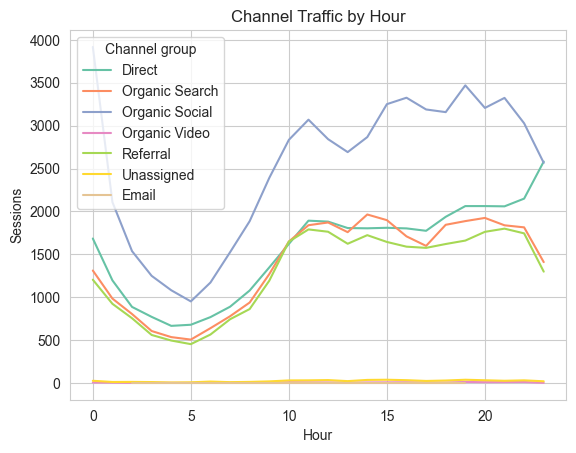
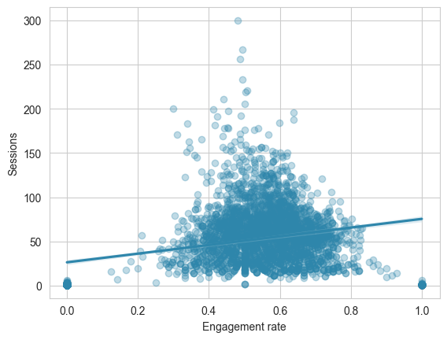

# 📊 Website Traffic & User Engagement Analysis using Python

Analyzed website traffic and user engagement using Python to uncover trends, channel performance, and behavioral insights.

---

## 🎯 Problem Statement
Understanding how users interact with a website is crucial for improving engagement and optimizing marketing strategies.  
This project analyzes website data to identify patterns in traffic, user behavior, and channel performance.

---

## 🔧 Tools & Technologies
- Python  
- Pandas  
- NumPy  
- Matplotlib / Seaborn  
- Jupyter Notebook  

---

## 📁 Dataset
The dataset contains website traffic metrics such as:
- Sessions  
- Users  
- Engagement Rate  
- Average Engagement Time  
- Traffic Source (Channel)  
- Timestamp (Date & Hour)  

---

## 📈 Key Analysis Performed
- Time series analysis of sessions and users  
- Channel-wise traffic comparison  
- Engagement rate and average engagement time analysis  
- Engaged vs non-engaged session comparison  
- Hourly traffic distribution analysis  
- Correlation between sessions and engagement rate  

---

## 💡 Key Insights
- High traffic does not always lead to high engagement  
- Some channels drive quality users with better engagement  
- Engagement varies significantly across different traffic sources  
- Peak traffic hours differ across channels  
- Weak correlation observed between sessions and engagement rate  

---

## 🧠 Business Insights
- High traffic channels are not always the most effective in driving engagement  
- Organic sources tend to bring more meaningful user interaction  
- Identifying peak hours can help optimize content posting and ad scheduling  

---

## 📸 Sample Visualizations

These visualizations highlight key patterns in website traffic and user engagement.

### 📊 Channel Traffic by Hour
This line plot shows how different traffic channels perform across various hours of the day.  
It helps identify peak activity times and understand when users are most active from each source.

---

### 📉 Engagement Rate vs Sessions
This scatter plot illustrates the relationship between engagement rate and number of sessions.  
It shows that higher traffic does not necessarily correspond to higher engagement, indicating varying user quality across channels.

---

## 📂 Project Structure

Website-data-analytics/
│
├── website-data-analysis.ipynb
├── data-export.csv
├── channel_traffic_by_hour.png
├── traffic_trend.png
└── README.md

---

## 🚀 Outcome
This project demonstrates how data analysis can be used to:
- Understand user behavior  
- Evaluate marketing channel effectiveness  
- Support data-driven decision making
  
---

## Author
**Pulkit Bhardwaj**
